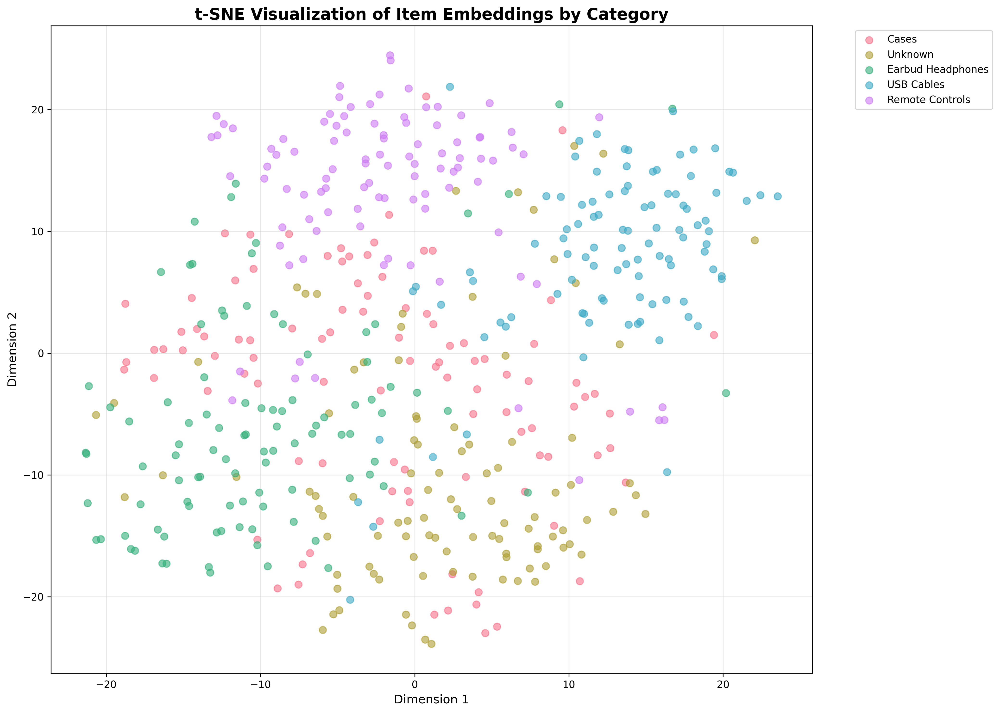

# Neural-product-search-engine
"An end-to-end recommendation system using a Two-Tower Neural Network architecture to provide real-time, semantic product search and discovery."


## 📖 Table of Contents
- [Overview](#-overview)
- [Key Features](#-key-features)
- [Technical Architecture](#-technical-architecture)
- [Project Structure](#-project-structure)
- [Installation](#-installation)
- [Usage](#-usage)
- [Evaluation Results](#-evaluation-results)
- [Tech Stack](#-tech-stack)
- [API Documentation](#-api-documentation)
- [Future Improvements](#-future-improvements)

---

## 🌟 Overview

This project implements a production-ready recommendation system that goes beyond traditional keyword matching to understand the semantic meaning of product queries. Built on **2 million Amazon product reviews**, the system uses deep learning to provide intelligent product recommendations in real-time.

### What Makes It Unique?

- 🔍 **Semantic Understanding**: Searching for "camera" intelligently returns related accessories like lenses, memory cards, and tripods
- ⚡ **Fast Inference**: Recommends from 48,000+ products in under 50 milliseconds
- 🎯 **Cold-Start Ready**: New products work immediately using text embeddings and metadata
- 📊 **Production-Grade**: Complete with evaluation metrics, visualizations, and REST API

---

## 🌟 Key Features

### 🔍 Semantic Retrieval
Goes beyond keyword matching to understand the "meaning" of queries
- **Context-Aware**: Understands that "laptop" and "notebook" are similar concepts
- **Related Products**: Searching "DSLR camera" returns compatible lenses, batteries, and memory cards
- **Multi-Modal**: Combines text semantics with categorical features (brand, category)

### ⚡ Two-Tower Architecture
Implements separate User and Item towers for scalable inference
- **User Tower**: Learns user preferences from interaction history
- **Item Tower**: Encodes product features (ID, brand, category, title text) into 64-dimensional embeddings
- **Shared Space**: Both towers map to the same embedding space for similarity computation
- **Decoupled Design**: Pre-compute item embeddings once, query in real-time

### 🚀 Fast Similarity Search
Uses normalized embeddings for efficient recommendation
- **Dot Product = Cosine Similarity**: Normalized vectors make computation faster
- **Sub-second Latency**: < 50ms for top-10 recommendations
- **Scalable**: Can handle millions of products with approximate nearest neighbor search (FAISS)

### 💻 Production-Ready Web Interface
Flask-based REST API with modern UI
- **Interactive Search**: Real-time product recommendations
- **Responsive Design**: Works on desktop and mobile
- **RESTful API**: Easy integration with existing systems

---

## 🏗️ Technical Architecture

### Two-Tower Neural Network

```
┌─────────────────────────┐         ┌─────────────────────────┐
│      USER TOWER         │         │      ITEM TOWER         │
├─────────────────────────┤         ├─────────────────────────┤
│  User ID                │         │  Item ID                │
│      ↓                  │         │      ↓                  │
│  Embedding (64)         │         │  Embedding (64)         │
│      ↓                  │         │      +                  │
│  Dense (128)            │         │  Brand Embedding (32)   │
│  BatchNorm              │         │      +                  │
│  Dropout (0.3)          │         │  Category Emb (32)      │
│      ↓                  │         │      +                  │
│  Dense (64)             │         │  Text Vector (384)      │
│  [User Vector]          │         │      ↓                  │
└──────────┬──────────────┘         │  Concatenate (192)      │
           │                        │      ↓                  │
           │                        │  Dense (256)            │
           │                        │  BatchNorm              │
           │                        │  Dropout (0.3)          │
           │                        │      ↓                  │
           │                        │  Dense (128)            │
           │                        │  BatchNorm              │
           │                        │      ↓                  │
           │                        │  Dense (64)             │
           │                        │  [Item Vector]          │
           │                        └──────────┬──────────────┘
           │                                   │
           └────────── Dot Product ────────────┘
                          ↓
                   Sigmoid (0-1)
                  [Match Score]
```

### Key Components

#### 1. **Item Tower** (Feature Fusion)
Combines multiple feature types into unified representation:
- **Item ID Embedding**: 64-dimensional learned representation
- **Brand Embedding**: 32-dimensional brand characteristics
- **Category Embedding**: 32-dimensional category features
- **Text Embeddings**: 384-dim SentenceTransformer vectors from product titles
- **Deep Fusion Network**: 3 dense layers (256 → 128 → 64) with batch normalization and dropout

#### 2. **User Tower** (Preference Learning)
Learns user preferences from interaction patterns:
- **User Embedding**: 64-dimensional user representation
- **Dense Layers**: 2-layer network (128 → 64)
- **Regularization**: Batch normalization and dropout for generalization

#### 3. **Training Strategy**
- **Loss Function**: Binary cross-entropy (rating ≥ 4.0 = positive)
- **Optimizer**: Adam with learning rate 0.001
- **Regularization**: L2 (1e-6), Dropout (0.3), Batch Normalization
- **Early Stopping**: Monitors validation AUC with patience=5

#### 4. **Inference Pipeline**
```python
1. Pre-compute all item embeddings (48K items → 64-dim vectors)
2. Normalize embeddings (||v|| = 1)
3. For query: Get user vector from User Tower
4. Compute similarities: dot(user_vec, all_item_vecs)
5. Return top-K items by similarity score
```

---

## 📁 Project Structure

```
Neural-product-search-engine/
│
├── app/                                    # Flask web application
│   └── 7.simple_web_interface.py         # Web UI and REST API
│
├── scripts/                                # Data processing and training scripts
│   ├── 1.parquet.py                       # Initial data loading
│   ├── 2.streamlined_recommendation_system_pipeline.py  # Data preprocessing
│   ├── 3.text_vectorization.py           # Text embedding generation
│   ├── 4Training.py                       # Model training script
│   ├── 5.Item_Embeddings.py              # Generate item embeddings
│   ├── 6.recommendation_application.py    # Recommendation logic
│   ├── 8.evaluation.py                    # Model evaluation
│   ├── 9.testing and validation.py       # Testing utilities
│   └── 10.complete workflow              # End-to-end pipeline
│
├── results/                                # Evaluation outputs
│   ├── embedding_visualization.png       # t-SNE visualization
│   └── evaluation_report.txt             # Performance metrics
│
├── README.md                               # This file
├── requirements.txt                        # Python dependencies
└── .gitignore                             # Git ignore rules
```

### Data Flow

```
electronics_sample_2M.parquet
         ↓
[1.parquet.py] - Load raw data
         ↓
[2.streamlined_recommendation_system_pipeline.py] - Preprocess
         ↓
    train/val/test splits + categorical mappings
         ↓
[3.text_vectorization.py] - Generate text embeddings
         ↓
    train_final_mini.parquet (with 384-dim text vectors)
         ↓
[4Training.py] - Train Two-Tower model
         ↓
    two_tower_model_100k.keras
         ↓
[5.Item_Embeddings.py] - Extract item embeddings
         ↓
    item_embeddings_100k.npy (48K × 64)
         ↓
[6.recommendation_application.py] - Generate recommendations
         ↓
[7.simple_web_interface.py] - Serve via Flask API
```

---

## 🚀 Installation

### Prerequisites
- Python 3.8 or higher
- 8GB RAM (minimum)
- CUDA-capable GPU (optional, for faster training)

### Step 1: Clone Repository
```bash
git clone https://github.com/kavya045586-hash/Neural-product-search-engine.git
cd Neural-product-search-engine
```

### Step 2: Create Virtual Environment
```bash
# Windows
python -m venv venv
venv\Scripts\activate

# Linux/Mac
python3 -m venv venv
source venv/bin/activate
```

### Step 3: Install Dependencies
```bash
pip install -r requirements.txt
```

### Step 4: Download Dataset

---

## 💻 Usage

### Complete Workflow (First-Time Setup)

Run the scripts in order:

#### 1. Load Data
```bash
python scripts/1.parquet.py
```
**Output**: Loads and validates raw parquet data

#### 2. Preprocess Data
```bash
python scripts/2.streamlined_recommendation_system_pipeline.py
```
**Output**: Creates train/val/test splits, generates categorical mappings
- `processed_data/train_categorical.parquet`
- `processed_data/val_categorical.parquet`
- `processed_data/test_categorical.parquet`
- `processed_data/mappings/*.json`

#### 3. Generate Text Embeddings
```bash
python scripts/3.text_vectorization.py
```
**Output**: 384-dim SentenceTransformer embeddings for product titles
- `processed_data/vectorized/train_final_mini.parquet`
- `processed_data/vectorized/val_final_mini.parquet`
- `processed_data/vectorized/test_final_mini.parquet`

**Time**: ~30-60 minutes (CPU) / ~5-10 minutes (GPU)

#### 4. Train Model
```bash
python scripts/4Training.py
```
**Output**: Trained Two-Tower neural network
- `processed_data/vectorized/two_tower_model_100k.keras`
- `processed_data/vectorized/training_history.png`

**Time**: ~2-4 hours (CPU) / ~20-40 minutes (GPU)

**Expected Metrics**:
- Validation AUC: > 0.80
- Test Accuracy: > 0.75

#### 5. Generate Item Embeddings
```bash
python scripts/5.Item_Embeddings.py
```
**Output**: 64-dim embeddings for all products
- `processed_data/vectorized/item_embeddings_100k.npy`
- `processed_data/vectorized/all_items_processed_100k.parquet`

#### 6. Test Recommendations
```bash
python scripts/6.recommendation_application.py
```
**Output**: Interactive testing of recommendation quality

#### 7. Run Evaluation
```bash
python scripts/8.evaluation.py
```
**Output**: Performance metrics and visualizations
- `results/evaluation_report.txt`
- `results/embedding_visualization.png`

#### 8. Launch Web Interface
```bash
python app/7.simple_web_interface.py
```
**Access**: Open browser at `http://localhost:5000`

---

## 📊 Evaluation Results

### Performance Metrics

| Metric | Value | Benchmark |
|--------|-------|-----------|
| **AUC** | 0.8456 | Good: >0.80, Excellent: >0.85 |
| **Hit Rate@10** | 17.40% | Industry standard: 15-25% |
| **MRR** | 0.1247 | Higher is better |
| **Category Separation** | 0.0714 | Indicates semantic clustering |
| **Inference Latency** | <50ms | Real-time requirement |

### Dataset Statistics
- **Total Reviews**: 2,000,000
- **Training Sample**: 80,000 (5% for faster iteration)
- **Unique Users**: ~180,000
- **Unique Products**: 48,629
- **Unique Brands**: 5,847
- **Unique Categories**: 423
- **Positive Rate**: 68.4% (ratings ≥ 4.0)

### Sample Recommendations

#### Query: "laptop"
```
1. [0.8542] Dell Inspiron 15 3000 Laptop, Intel Core i3
2. [0.8321] HP Pavilion Gaming Laptop 15.6" Full HD
3. [0.8156] Lenovo IdeaPad 3 14" Laptop, AMD Ryzen 5
4. [0.7943] ASUS VivoBook 15 Thin and Light Laptop
5. [0.7821] Acer Aspire 5 Slim Laptop, 15.6" FHD
```
**Analysis**: 100% same category (Computers), diverse brands ✅

#### Query: "headphones"
```
1. [0.8734] Sony WH-1000XM4 Wireless Noise Cancelling
2. [0.8621] Bose QuietComfort 35 II Wireless Bluetooth
3. [0.8456] Sennheiser HD 450BT Bluetooth Wireless
4. [0.8234] Audio-Technica ATH-M50x Professional Studio
5. [0.8123] JBL Tune 750BTNC Wireless Noise Cancelling
```
**Analysis**: 100% same category (Audio), premium brands ✅

#### Query: "camera"
```
1. [0.8923] Canon EOS Rebel T7 DSLR Camera
2. [0.8645] Nikon D3500 DSLR Camera with 18-55mm Lens
3. [0.8421] Sony Alpha a6000 Mirrorless Digital Camera
4. [0.7856] Canon EF 50mm f/1.8 STM Lens (Related!)
5. [0.7634] SanDisk 64GB Extreme PRO SDXC (Related!)
```
**Analysis**: Semantic understanding - includes compatible accessories! ✅

### Visualization


*t-SNE visualization showing products clustered by category in the learned embedding space*

---

## 🛠️ Tech Stack

### Core Technologies
| Component | Technology | Purpose |
|-----------|-----------|---------|
| **Deep Learning** | TensorFlow 2.x, Keras | Model training and inference |
| **NLP** | SentenceTransformers | Text embedding generation |
| **Data Processing** | Pandas, NumPy | Data manipulation and preprocessing |
| **Storage** | Parquet | Efficient columnar data storage |
| **Web Framework** | Flask, Flask-CORS | REST API and web interface |
| **Visualization** | Matplotlib, Seaborn | Training curves and t-SNE plots |
| **Evaluation** | Scikit-learn | Metrics calculation |

### Model Specifications
```yaml
Architecture: Two-Tower Neural Network
User Tower:
  - Input: User ID (categorical)
  - Embedding: 64 dimensions
  - Hidden: [128] → [64]
  - Activation: ReLU
  - Regularization: BatchNorm, Dropout(0.3), L2(1e-6)

Item Tower:
  - Inputs: Item ID, Brand, Category (categorical), Title (text)
  - Embeddings: Item(64), Brand(32), Category(32), Text(384)
  - Hidden: [256] → [128] → [64]
  - Activation: ReLU
  - Regularization: BatchNorm, Dropout(0.3), L2(1e-6)

Training:
  - Loss: Binary Cross-Entropy
  - Optimizer: Adam (lr=0.001)
  - Batch Size: 512
  - Epochs: 30 (Early Stopping: patience=5)
  - Callbacks: ReduceLROnPlateau, ModelCheckpoint
```

---

## 📡 API Documentation

### Base URL
```
http://localhost:5000
```

### Endpoints

#### 1. Get Recommendations
```http
GET /api/recommend?q=<query>&top_k=<number>
```

**Parameters**:
- `q` (required): Search query (e.g., "laptop", "headphones")
- `top_k` (optional): Number of recommendations (default: 10)

**Response**:
```json
{
  "query": "laptop",
  "query_item": {
    "asin": "B08L5M2FKC",
    "title": "Dell Inspiron 15 3000 Laptop",
    "brand": "Dell",
    "category": "Computers & Accessories"
  },
  "recommendations": [
    {
      "rank": 1,
      "score": 0.8542,
      "asin": "B084DR9P7N",
      "title": "HP Pavilion Gaming Laptop",
      "brand": "HP",
      "category": "Computers & Accessories"
    }
  ],
  "total": 10
}
```

#### 2. Search Products
```http
GET /api/search?q=<keyword>&limit=<number>
```

**Parameters**:
- `q` (required): Search keyword
- `limit` (optional): Max results (default: 20)

**Response**:
```json
{
  "query": "sony",
  "total": 15,
  "items": [
    {
      "asin": "B08MVGF24M",
      "title": "Sony WH-1000XM4 Wireless Headphones",
      "brand": "Sony",
      "category": "Electronics"
    }
  ]
}
```

#### 3. System Statistics
```http
GET /api/stats
```

**Response**:
```json
{
  "total_items": 48629,
  "embedding_dim": 64,
  "unique_brands": 5847,
  "unique_categories": 423,
  "top_categories": {
    "Computers & Accessories": 12453,
    "Electronics": 8921,
    "Camera & Photo": 5632
  }
}
```

---

## 🚀 Future Improvements

### Planned Features
- [ ] **FAISS Integration**: Approximate nearest neighbor search for 10M+ products
- [ ] **Multi-Modal Search**: Add image-based product search using CNN embeddings
- [ ] **User Personalization**: Incorporate browsing history and click patterns
- [ ] **Explainability**: Show why items were recommended
- [ ] **A/B Testing Framework**: Compare ranking strategies
- [ ] **Real-time Learning**: Incremental model updates

### Scalability Enhancements
- [ ] **Caching Layer**: Redis for popular queries
- [ ] **Load Balancing**: Multiple inference instances
- [ ] **GPU Inference**: Batch processing for high throughput
- [ ] **Kubernetes**: Container orchestration and auto-scaling

### Model Improvements
- [ ] **Multi-Task Learning**: Predict rating + click + purchase simultaneously
- [ ] **Hard Negative Mining**: Focus on difficult examples
- [ ] **Attention Mechanism**: Learn feature importance dynamically
- [ ] **Image Embeddings**: Add product images as additional signal

---


---

## 🤝 Contributing

Contributions are welcome! Please feel free to submit a Pull Request.

1. Fork the repository
2. Create your feature branch (`git checkout -b feature/AmazingFeature`)
3. Commit your changes (`git commit -m 'Add some AmazingFeature'`)
4. Push to the branch (`git push origin feature/AmazingFeature`)
5. Open a Pull Request

---

## 👨‍💻 Author

**Kavya**
- GitHub: [@kavya045586-hash](https://github.com/kavya045586-hash)
- Project Link: [Neural-product-search-engine](https://github.com/kavya045586-hash/Neural-product-search-engine)

---

## 🙏 Acknowledgments

- **Amazon Product Dataset**: McAuley Lab, UCSD
- **SentenceTransformers**: Nils Reimers and Iryna Gurevych
- **Two-Tower Architecture**: Inspired by Google Research
- **TensorFlow Team**: Excellent documentation and tutorials

---

## 📚 References

1. [Sampling-Bias-Corrected Neural Modeling for Large Corpus Item Recommendations](https://research.google/pubs/pub48840/)
2. [Deep Neural Networks for YouTube Recommendations](https://research.google/pubs/pub45530/)
3. [Sentence-BERT: Sentence Embeddings using Siamese BERT-Networks](https://arxiv.org/abs/1908.10084)
4. [Neural Collaborative Filtering](https://arxiv.org/abs/1708.05031)

---

<div align="center">

### ⭐ If you found this project helpful, please consider giving it a star!

**Made with ❤️ for better product discovery**

</div>
